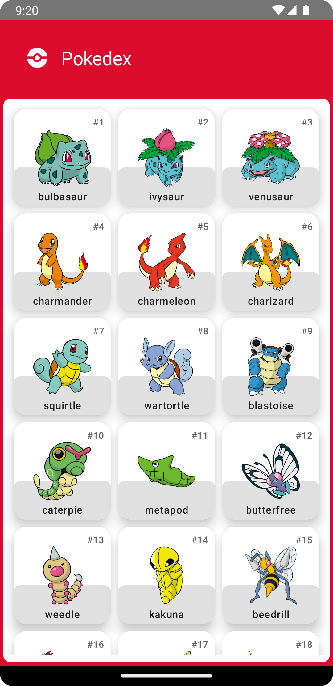
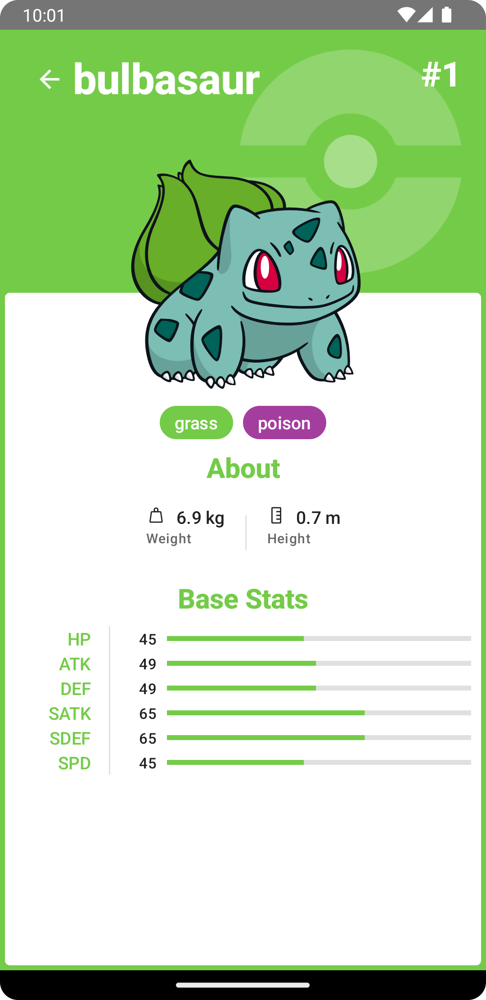

# Sample Pokedex App

Cette application Android est un Pokedex. Les données sont fournies par [PokéApi](https://pokeapi.co/). 

Le design de l'application a été fait par [Ricardo Schiniegoski](https://www.figma.com/@ricardohs)
 

- 👅 : Kotlin
- 👷‍ : Clean Architecture
- 🎨 : Jetpack compose
- 💉 : Hilt
- 📊 : OkHttp pour les appels API
- 🤹‍ : Mockito

| Grille des pokemons | Détail d'un pokemon |
|--|--|
|  |  |

